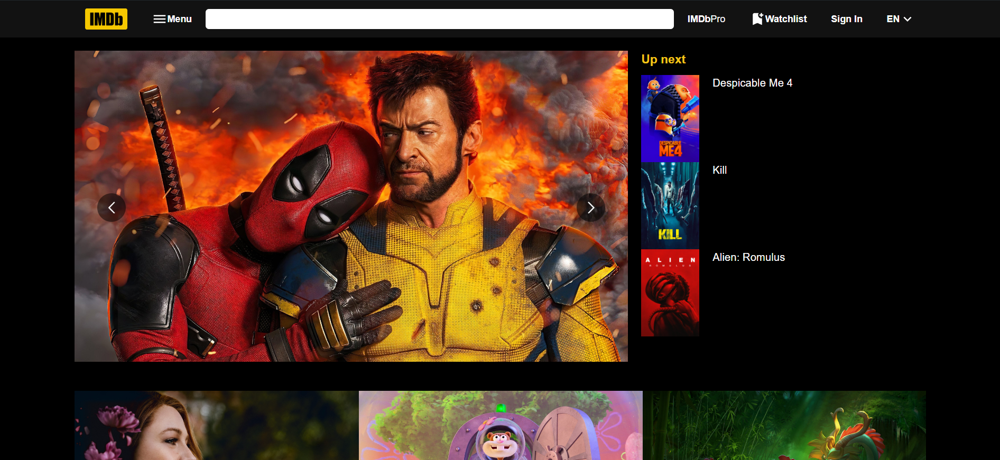
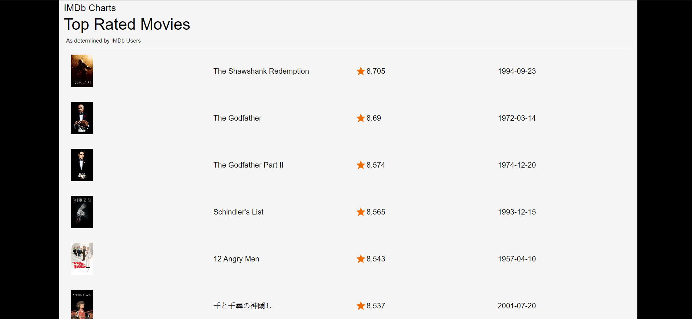

# IMDb Clone

## Overview:
The IMDb Clone is a frontend application built using ReactJS and JavaScript, designed to replicate the basic functionalities of the IMDb website. This project showcases the use of modern web development techniques and libraries, focusing on creating a responsive and user-friendly interface. The project does not include a backend or database, making it a purely frontend-driven application.

## Screenshots




<h3 align="center">

</h3>

## Features
- **Movie Listings**: Displays a list of movies with details such as title, release date, rating, and genre.
- **Responsive Design**: Optimized for different screen sizes, ensuring a seamless experience on both desktop and mobile devices.
- **Dynamic Content**: Utilizes ReactJS to dynamically update the UI based on user interactions.

## Technology Stack
- **ReactJS**: For building the user interface.
- **JavaScript**: Core language for implementing functionality.
- **HTML**: Structure of the web pages.
- **CSS**: Styling the application for a visually appealing interface.
- **React Router**: For handling routing within the application.
- **Axios** (Optional): For making API calls if needed in future expansions.

## Prerequisites
- **Node.js**: Ensure that Node.js is installed on your machine.
- **npm**: Node package manager to install dependencies.

## Installation
 **Clone the Repository**:
   ```bash
   git clone https://github.com/Aditya-Mohite/imdb-clone.git
   ```
